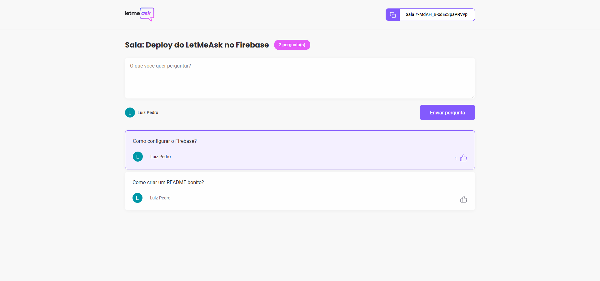
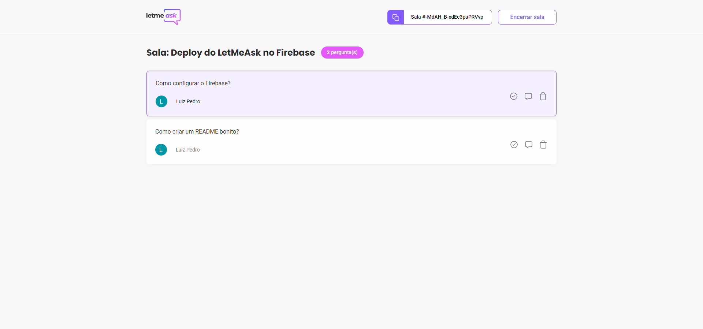

# LetMeAsk

  

  

 

 

## 💻 LetMeAsk

O LetMeAsk é um app onde se cria salas para responder perguntas.

## 🔖 Layout

Você pode visualizar o layout do projeto através [desse link](https://www.figma.com/file/u0BQK8rCf2KgzcukdRRCWh/Letmeask/duplicate?node-id=0%3A1). É necessário ter conta no [Figma](http://figma.com/) para acessá-lo.

## 📷 Imagens

### 🖥️ Desktop

### Usuário

### Admin

## 🚀 Como executar

- Clone o repositório
- Instale as dependências com `yarn`
- Rode o app com `yarn start`

Agora você pode acessar [`localhost:3000`](http://localhost:3000) do seu navegador.

## ✨ Tecnologias

Esse projeto foi desenvolvido com as seguintes tecnologias:

- [React](https://reactjs.org)
- [TypeScript](https://www.typescriptlang.org)
- [Gitmoji](https://gitmoji.dev)

---

Feito com 💜 by Luiz 👋🏻
